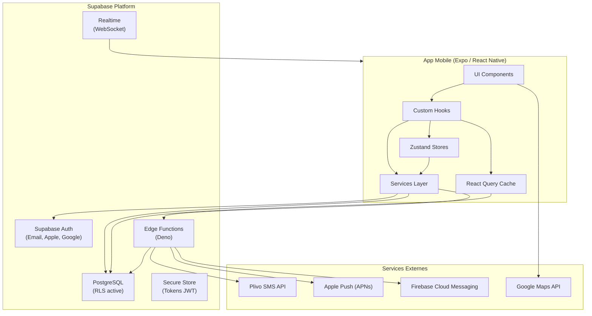
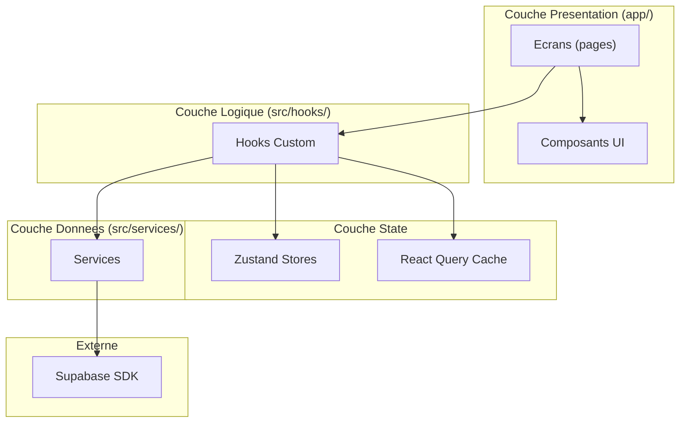
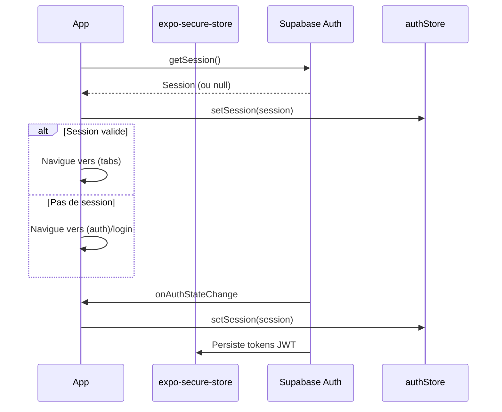
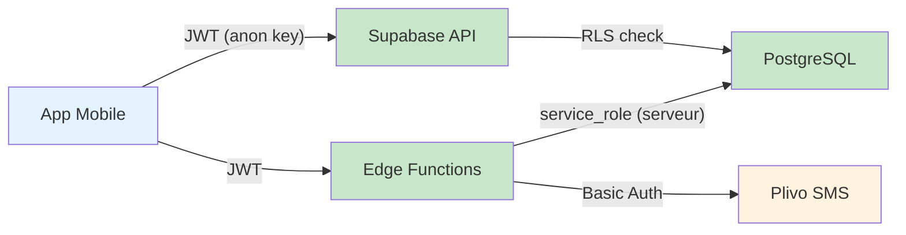

# Architecture -- Prudency

## Table des matieres

- [Vue d'ensemble](#vue-densemble)
- [Diagramme d'architecture](#diagramme-darchitecture)
- [Stack technique](#stack-technique)
- [Structure du projet](#structure-du-projet)
- [Couches applicatives](#couches-applicatives)
- [Flux de donnees](#flux-de-donnees)
- [Securite](#securite)
- [Decisions techniques](#decisions-techniques)

---

## Vue d'ensemble

Prudency est une application mobile de securite des trajets destinee aux femmes de 18 a 44 ans. L'application permet de creer des trajets chronometres, de suivre la position GPS, et de declencher des alertes (manuelles ou automatiques) qui notifient les contacts de confiance par SMS et push notifications.

L'architecture suit un modele **client-serverless** :
- **Client** : Application React Native (Expo) pour iOS et Android
- **Backend** : Supabase (PostgreSQL, Auth, Edge Functions, Realtime)
- **SMS** : Plivo (API REST pour l'envoi de SMS)

---

## Diagramme d'architecture



---

## Stack technique

### Client (Mobile)

| Technologie | Role | Version |
|-------------|------|---------|
| React Native | Framework UI mobile | 0.81.x |
| Expo | Plateforme de dev et build | SDK 54 |
| Expo Router | Navigation file-based | 6.x |
| TypeScript | Typage statique | 5.9.x |
| Zustand | State management global | 5.x |
| TanStack React Query | Data fetching et cache | 5.x |
| Zod | Validation des donnees | 4.x |
| React Native Maps | Cartographie | 1.x |
| React Native Reanimated | Animations | 4.x |

### Backend (Supabase)

| Technologie | Role |
|-------------|------|
| PostgreSQL | Base de donnees relationnelle |
| Supabase Auth | Authentification (Email, Apple, Google) |
| Edge Functions (Deno) | Logique metier serverless |
| Supabase Realtime | Notifications temps reel (WebSocket) |
| Row Level Security | Securite au niveau des lignes |

### Services externes

| Service | Role |
|---------|------|
| Plivo | Envoi de SMS aux contacts de confiance |
| Apple APNs | Push notifications iOS |
| Firebase FCM | Push notifications Android |
| Google Maps | Affichage de cartes et geocoding |

### Modules Expo

| Module | Role |
|--------|------|
| expo-location | Tracking GPS |
| expo-notifications | Push notifications |
| expo-apple-authentication | Apple Sign In |
| expo-auth-session | OAuth (Google Sign In) |
| expo-web-browser | Flux OAuth externe |
| expo-secure-store | Stockage securise des tokens |
| expo-haptics | Retour haptique (alerte) |
| expo-battery | Niveau de batterie |

---

## Structure du projet

```
prudency/
├── CLAUDE.md                     # Instructions projet
├── app.json                      # Configuration Expo
├── package.json                  # Dependances
├── tsconfig.json                 # Configuration TypeScript
│
├── app/                          # Expo Router (file-based routing)
│   ├── _layout.tsx               # Root layout (providers, AuthGate)
│   ├── +not-found.tsx            # Page 404
│   ├── modal.tsx                 # Modal generique
│   ├── (auth)/                   # Groupe auth (non authentifie)
│   │   ├── _layout.tsx           # Layout auth
│   │   ├── login.tsx             # Ecran connexion
│   │   ├── register.tsx          # Ecran inscription
│   │   └── onboarding.tsx        # Ecran onboarding
│   ├── (tabs)/                   # Groupe principal (authentifie)
│   │   ├── _layout.tsx           # Layout tabs (Accueil, Contacts, Profil)
│   │   ├── index.tsx             # Ecran Accueil
│   │   ├── contacts.tsx          # Ecran Contacts
│   │   └── profile.tsx           # Ecran Profil
│   └── (trip)/                   # Groupe trajet (modal/stack)
│       ├── _layout.tsx           # Layout trajet
│       ├── create.tsx            # Creation de trajet
│       ├── active.tsx            # Trajet en cours
│       ├── notes.tsx             # Notes de trajet
│       └── complete.tsx          # Trajet termine
│
├── src/
│   ├── components/               # Composants UI reutilisables
│   ├── hooks/                    # Hooks custom (logique metier)
│   ├── services/                 # Couche d'acces donnees
│   │   ├── supabaseClient.ts     # Client Supabase configure
│   │   └── authService.ts        # Service d'authentification
│   ├── stores/                   # Zustand stores (state global)
│   │   ├── authStore.ts          # Store auth (session, user)
│   │   └── tripStore.ts          # Store trajet (activeTripId, tracking)
│   ├── types/                    # Types TypeScript
│   │   ├── database.ts           # Types generes depuis Supabase
│   │   ├── trip.ts               # Types trajet
│   │   ├── alert.ts              # Types alerte
│   │   ├── contact.ts            # Types contact
│   │   └── navigation.ts         # Types navigation
│   ├── utils/                    # Utilitaires
│   │   ├── constants.ts          # Constantes de configuration
│   │   ├── validators.ts         # Schemas de validation Zod
│   │   ├── formatters.ts         # Formatage de donnees
│   │   ├── permissions.ts        # Gestion des permissions OS
│   │   └── battery.ts            # Utilitaires batterie
│   ├── config/                   # Configuration
│   │   ├── env.ts                # Variables d'environnement
│   │   └── queryClient.ts        # Configuration React Query
│   └── theme/                    # Design system
│       ├── index.ts              # Export centralise
│       ├── colors.ts             # Palette de couleurs
│       ├── typography.ts         # Typographie
│       └── spacing.ts            # Espacements
│
├── supabase/
│   ├── migrations/               # Migrations SQL (7 fichiers)
│   └── functions/                # Edge Functions (Deno)
│       ├── send-alert/           # Orchestration d'alerte
│       ├── send-sms/             # Envoi SMS via Plivo
│       │   ├── index.ts
│       │   └── types.ts
│       ├── check-trip-timeout/   # Verification timeout trajet
│       ├── update-location/      # Mise a jour position GPS
│       │   └── types.ts
│       └── notify-contacts/      # Notification des contacts
│
├── docs/                         # Documentation
│   ├── architecture.md           # Ce fichier
│   ├── database-schema.md        # Schema de la BDD
│   ├── api-reference.md          # Reference des Edge Functions
│   ├── user-flows.md             # Parcours utilisateur
│   ├── deployment.md             # Guide de deploiement
│   └── local-development.md      # Guide de dev local
│
└── assets/                       # Images, fonts, icones
```

---

## Couches applicatives

L'architecture suit une separation stricte en couches :



### Regles

1. **Les composants UI ne contiennent pas de logique metier.** Toute logique passe par des hooks custom.
2. **Les services ne connaissent pas l'UI.** Ils manipulent uniquement les donnees via le client Supabase.
3. **Les stores Zustand sont legers.** Ils stockent uniquement l'etat de session (`authStore`) et du trajet en cours (`tripStore`).
4. **React Query gere le cache et le refetching.** Les donnees distantes (trajets, contacts, alertes) passent par React Query.
5. **Les Edge Functions sont des microservices independants.** Chacune a ses propres types et sa validation Zod.

---

## Flux de donnees

### Authentification



Le composant `AuthGate` dans `app/_layout.tsx` orchestre cette logique. Les tokens sont stockes dans `expo-secure-store` via un adaptateur personnalise.

### Trajet

```
Utilisateur --> [Create Trip Screen]
                    |
                    v
              [tripService.createTrip()]
                    |
                    v
              [Supabase DB: INSERT trips]
                    |
                    v
              [tripStore.setActiveTrip(tripId)]
                    |
                    v
              [Active Trip Screen]
                    |
                    v
              [expo-location: startTracking()]
                    |
                    v (toutes les 30s)
              [Edge Function: update-location]
                    |
                    v
              [Supabase DB: INSERT trip_locations]
```

### Alerte

```
Declenchement (manuel ou timeout)
        |
        v
  [Edge Function: send-alert]
        |
        +---> [INSERT alerts]
        |
        +---> [Edge Function: notify-contacts]
                    |
                    +---> [Edge Function: send-sms] x N contacts
                    |
                    +---> [Push notification] x N contacts
```

---

## Securite

### Principes

| Principe | Implementation |
|----------|----------------|
| Authentification | Supabase Auth (JWT) sur chaque requete |
| Autorisation | Row Level Security (RLS) sur toutes les tables |
| Stockage tokens | `expo-secure-store` (Keychain iOS, Keystore Android) |
| Secrets serveur | `Deno.env.get()` dans les Edge Functions (jamais cote client) |
| Cle `service_role` | Jamais exposee cote client |
| Validation entrees | Zod sur toutes les entrees (API, formulaires) |
| Rate limiting | Sur tous les endpoints critiques |
| Chiffrement | TLS en transit, chiffrement au repos par Supabase |
| Conformite RGPD | Region EU (`eu-west-1`), aucune vente de donnees |

### Architecture de securite



- Le client ne communique jamais directement avec Plivo
- La cle `anon` cote client a des permissions limitees par RLS
- Les Edge Functions utilisent la cle `service_role` pour des operations privilegiees (cron, notifications)
- Les tokens JWT sont rafraichis automatiquement (`autoRefreshToken: true`)

---

## Decisions techniques

### Expo plutot que React Native CLI

- Build simplifie via EAS (pas de Xcode/Android Studio au quotidien)
- Mise a jour OTA pour les changements JS-only
- Ecosysteme de modules natifs pre-configures (location, notifications, auth)
- Expo Router pour le routing file-based (similaire a Next.js)

### Supabase plutot qu'un backend custom

- Auth integree avec providers sociaux (Apple, Google)
- Base PostgreSQL avec RLS pour la securite au niveau des lignes
- Edge Functions pour la logique metier serverless
- Realtime pour les mises a jour en temps reel
- Pas de serveur a gerer ni a scaler

### Zustand plutot que Redux

- API minimale, pas de boilerplate
- Pas de providers necessaires (compatible avec Expo Router)
- Suffisant pour l'etat global leger (session, trajet actif)

### React Query plutot que des hooks custom pour le fetching

- Cache automatique avec invalidation
- Refetching intelligent (focus, reconnexion)
- Mutations avec rollback optimiste
- Gestion de l'etat de chargement et d'erreur

### Plivo plutot que Twilio pour les SMS

- Tarification plus competitive pour les SMS en France
- API REST simple et bien documentee
- Couverture internationale

### Zod pour la validation

- TypeScript-first : infere les types depuis les schemas
- Utilise cote client (formulaires) et serveur (Edge Functions)
- Messages d'erreur lisibles pour l'utilisateur

---

**Voir aussi :**
- [Schema BDD](./database-schema.md) -- structure detaillee de la base de donnees
- [Reference API](./api-reference.md) -- documentation des Edge Functions
- [User Flows](./user-flows.md) -- parcours utilisateur
- [Deploiement](./deployment.md) -- guide de mise en production
- [Developpement local](./local-development.md) -- guide de setup local
