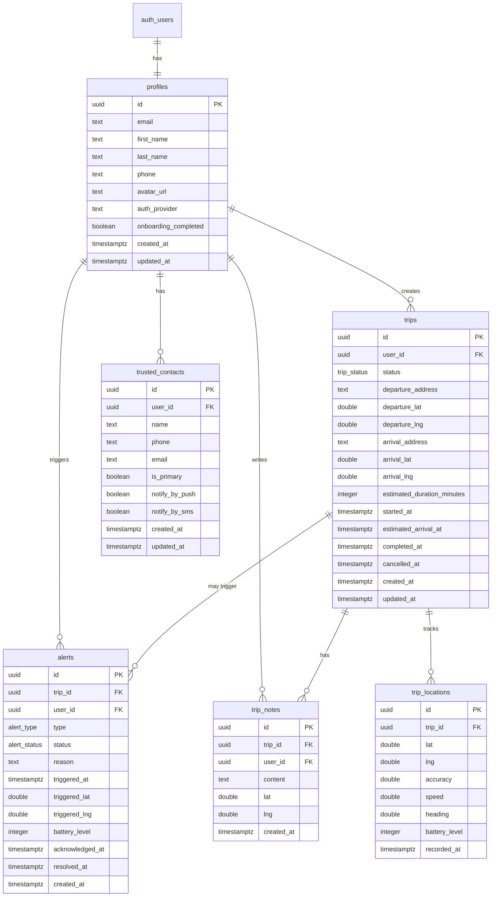

# Schema de Base de Donnees -- Prudency

## Table des matieres

- [Vue d'ensemble](#vue-densemble)
- [Tables](#tables)
  - [profiles](#1-profiles)
  - [trips](#2-trips)
  - [alerts](#3-alerts)
  - [trusted_contacts](#4-trusted_contacts)
  - [trip_notes](#5-trip_notes)
  - [trip_locations](#6-trip_locations)
- [Enums](#enums)
- [Fonctions et Triggers](#fonctions-et-triggers)
- [Contraintes metier](#contraintes-metier)
- [Index](#index)
- [Row Level Security (RLS)](#row-level-security-rls)
- [Diagramme ER](#diagramme-er)
- [Migrations](#migrations)

---

## Vue d'ensemble

La base de donnees Supabase (PostgreSQL) contient 6 tables principales avec Row Level Security (RLS) active sur chacune. Toutes les tables utilisent des UUID comme cles primaires et des timestamps avec timezone pour les dates.

---

## Tables

### 1. `profiles`

Profils utilisateurs, crees automatiquement a l'inscription via un trigger sur `auth.users`.

| Colonne | Type | Contraintes | Description |
|---------|------|-------------|-------------|
| `id` | UUID | PK, FK -> auth.users(id) ON DELETE CASCADE | ID utilisateur Supabase |
| `email` | TEXT | NOT NULL | Email de l'utilisateur |
| `first_name` | TEXT | NULL | Prenom |
| `last_name` | TEXT | NULL | Nom |
| `phone` | TEXT | NULL | Numero de telephone |
| `avatar_url` | TEXT | NULL | URL de l'avatar |
| `auth_provider` | TEXT | DEFAULT 'email' | Provider d'auth: 'email', 'apple', 'google' |
| `onboarding_completed` | BOOLEAN | DEFAULT FALSE | Onboarding termine |
| `created_at` | TIMESTAMPTZ | DEFAULT NOW() | Date de creation |
| `updated_at` | TIMESTAMPTZ | DEFAULT NOW() | Derniere mise a jour |

**Index :**
- `idx_profiles_email` sur `email`

**Triggers :**
- `profiles_updated_at` : Met a jour `updated_at` automatiquement (via `update_updated_at()`)
- `on_auth_user_created` : Cree le profil automatiquement a l'inscription (via `handle_new_user()`, SECURITY DEFINER)

**RLS Policies :**
- `Users can view own profile` (SELECT) : `auth.uid() = id`
- `Users can update own profile` (UPDATE) : `auth.uid() = id`

---

### 2. `trips`

Trajets crees par les utilisateurs.

| Colonne | Type | Contraintes | Description |
|---------|------|-------------|-------------|
| `id` | UUID | PK, DEFAULT gen_random_uuid() | ID du trajet |
| `user_id` | UUID | NOT NULL, FK -> profiles(id) ON DELETE CASCADE | Proprietaire |
| `status` | trip_status | DEFAULT 'draft' | Statut du trajet |
| `departure_address` | TEXT | NULL | Adresse de depart |
| `departure_lat` | DOUBLE PRECISION | NULL | Latitude depart |
| `departure_lng` | DOUBLE PRECISION | NULL | Longitude depart |
| `arrival_address` | TEXT | NULL | Adresse d'arrivee |
| `arrival_lat` | DOUBLE PRECISION | NULL | Latitude arrivee |
| `arrival_lng` | DOUBLE PRECISION | NULL | Longitude arrivee |
| `estimated_duration_minutes` | INTEGER | NOT NULL | Duree estimee en minutes |
| `started_at` | TIMESTAMPTZ | NULL | Heure de demarrage |
| `estimated_arrival_at` | TIMESTAMPTZ | NULL | Heure d'arrivee prevue |
| `completed_at` | TIMESTAMPTZ | NULL | Heure de completion |
| `cancelled_at` | TIMESTAMPTZ | NULL | Heure d'annulation |
| `created_at` | TIMESTAMPTZ | DEFAULT NOW() | Date de creation |
| `updated_at` | TIMESTAMPTZ | DEFAULT NOW() | Derniere mise a jour |

**Index :**
- `idx_trips_user_id` sur `user_id`
- `idx_trips_status` sur `status`
- `idx_trips_active` sur `(user_id, status)` -- index partiel WHERE `status = 'active'`
- `idx_trips_estimated_arrival` sur `estimated_arrival_at` -- index partiel WHERE `status = 'active'`

**Triggers :**
- `trips_updated_at` : Met a jour `updated_at` automatiquement (via `update_updated_at()`)

**RLS Policies :**
- `Users can view own trips` (SELECT) : `auth.uid() = user_id`
- `Users can create own trips` (INSERT) : `auth.uid() = user_id`
- `Users can update own trips` (UPDATE) : `auth.uid() = user_id`
- `Users can delete own trips` (DELETE) : `auth.uid() = user_id`

---

### 3. `alerts`

Alertes declenchees (manuelles ou automatiques).

| Colonne | Type | Contraintes | Description |
|---------|------|-------------|-------------|
| `id` | UUID | PK, DEFAULT gen_random_uuid() | ID de l'alerte |
| `trip_id` | UUID | FK -> trips(id) ON DELETE SET NULL | Trajet associe (optionnel) |
| `user_id` | UUID | NOT NULL, FK -> profiles(id) ON DELETE CASCADE | Utilisateur |
| `type` | alert_type | NOT NULL | Type d'alerte |
| `status` | alert_status | DEFAULT 'triggered' | Statut de l'alerte |
| `reason` | TEXT | NULL | Raison de l'alerte |
| `triggered_at` | TIMESTAMPTZ | DEFAULT NOW() | Heure de declenchement |
| `triggered_lat` | DOUBLE PRECISION | NULL | Latitude au declenchement |
| `triggered_lng` | DOUBLE PRECISION | NULL | Longitude au declenchement |
| `battery_level` | INTEGER | NULL | Niveau de batterie (%) |
| `acknowledged_at` | TIMESTAMPTZ | NULL | Heure de prise en charge |
| `resolved_at` | TIMESTAMPTZ | NULL | Heure de resolution |
| `created_at` | TIMESTAMPTZ | DEFAULT NOW() | Date de creation |

**Index :**
- `idx_alerts_user_id` sur `user_id`
- `idx_alerts_trip_id` sur `trip_id`
- `idx_alerts_status` sur `status`
- `idx_alerts_triggered_at` sur `triggered_at DESC`

**RLS Policies :**
- `Users can view own alerts` (SELECT) : `auth.uid() = user_id`
- `Users can create own alerts` (INSERT) : `auth.uid() = user_id`
- `Users can update own alerts` (UPDATE) : `auth.uid() = user_id`

---

### 4. `trusted_contacts`

Contacts de confiance a prevenir en cas d'alerte.

| Colonne | Type | Contraintes | Description |
|---------|------|-------------|-------------|
| `id` | UUID | PK, DEFAULT gen_random_uuid() | ID du contact |
| `user_id` | UUID | NOT NULL, FK -> profiles(id) ON DELETE CASCADE | Proprietaire |
| `name` | TEXT | NOT NULL | Nom du contact |
| `phone` | TEXT | NOT NULL | Numero de telephone |
| `email` | TEXT | NULL | Email (optionnel) |
| `is_primary` | BOOLEAN | DEFAULT FALSE | Contact principal |
| `notify_by_push` | BOOLEAN | DEFAULT TRUE | Notifier par push |
| `notify_by_sms` | BOOLEAN | DEFAULT TRUE | Notifier par SMS |
| `created_at` | TIMESTAMPTZ | DEFAULT NOW() | Date de creation |
| `updated_at` | TIMESTAMPTZ | DEFAULT NOW() | Derniere mise a jour |

**Index :**
- `idx_contacts_user_id` sur `user_id`
- `idx_contacts_primary` sur `(user_id, is_primary)` -- index partiel WHERE `is_primary = TRUE`

**Triggers :**
- `contacts_updated_at` : Met a jour `updated_at` automatiquement (via `update_updated_at()`)
- `enforce_max_contacts` : Empeche l'insertion au-dela de 5 contacts par utilisateur (via `check_max_contacts()`)

**Contrainte metier :**
- Maximum 5 contacts de confiance par utilisateur (appliquee par trigger BEFORE INSERT)

**RLS Policies :**
- `Users can view own contacts` (SELECT) : `auth.uid() = user_id`
- `Users can create own contacts` (INSERT) : `auth.uid() = user_id`
- `Users can update own contacts` (UPDATE) : `auth.uid() = user_id`
- `Users can delete own contacts` (DELETE) : `auth.uid() = user_id`

---

### 5. `trip_notes`

Notes ajoutees pendant un trajet.

| Colonne | Type | Contraintes | Description |
|---------|------|-------------|-------------|
| `id` | UUID | PK, DEFAULT gen_random_uuid() | ID de la note |
| `trip_id` | UUID | NOT NULL, FK -> trips(id) ON DELETE CASCADE | Trajet parent |
| `user_id` | UUID | NOT NULL, FK -> profiles(id) ON DELETE CASCADE | Auteur |
| `content` | TEXT | NOT NULL | Contenu de la note |
| `lat` | DOUBLE PRECISION | NULL | Latitude lors de la note |
| `lng` | DOUBLE PRECISION | NULL | Longitude lors de la note |
| `created_at` | TIMESTAMPTZ | DEFAULT NOW() | Date de creation |

**Index :**
- `idx_trip_notes_trip_id` sur `trip_id`
- `idx_trip_notes_created_at` sur `(trip_id, created_at DESC)`

**Triggers :**
- `enforce_max_trip_notes` : Empeche l'insertion au-dela de 20 notes par trajet (via `check_max_trip_notes()`)

**Contrainte metier :**
- Maximum 20 notes par trajet (appliquee par trigger BEFORE INSERT)

**RLS Policies :**
- `Users can view own trip notes` (SELECT) : `auth.uid() = user_id`
- `Users can create own trip notes` (INSERT) : `auth.uid() = user_id`
- `Users can delete own trip notes` (DELETE) : `auth.uid() = user_id`

---

### 6. `trip_locations`

Positions GPS trackees pendant les trajets.

| Colonne | Type | Contraintes | Description |
|---------|------|-------------|-------------|
| `id` | UUID | PK, DEFAULT gen_random_uuid() | ID de la position |
| `trip_id` | UUID | NOT NULL, FK -> trips(id) ON DELETE CASCADE | Trajet parent |
| `lat` | DOUBLE PRECISION | NOT NULL | Latitude |
| `lng` | DOUBLE PRECISION | NOT NULL | Longitude |
| `accuracy` | DOUBLE PRECISION | NULL | Precision en metres |
| `speed` | DOUBLE PRECISION | NULL | Vitesse en m/s |
| `heading` | DOUBLE PRECISION | NULL | Direction en degres |
| `battery_level` | INTEGER | NULL | Niveau de batterie (0-100) |
| `recorded_at` | TIMESTAMPTZ | DEFAULT NOW() | Heure d'enregistrement |

**Index :**
- `idx_trip_locations_trip_id` sur `trip_id`
- `idx_trip_locations_recorded` sur `(trip_id, recorded_at DESC)`

**RLS Policies :**
- `Users can view own trip locations` (SELECT) : via sous-requete sur `trips.user_id = auth.uid()`
- `Users can insert own trip locations` (INSERT) : via sous-requete sur `trips.user_id = auth.uid()`

---

## Enums

### `trip_status`

| Valeur | Description |
|--------|-------------|
| `draft` | Trajet en preparation |
| `active` | Trajet en cours |
| `completed` | Trajet termine normalement |
| `cancelled` | Trajet annule par l'utilisateur |
| `timeout` | Timeout sans validation d'arrivee |
| `alerted` | Alerte declenchee |

### `alert_type`

| Valeur | Description |
|--------|-------------|
| `manual` | Declenchee volontairement par l'utilisateur |
| `automatic` | Declenchee par le systeme |
| `timeout` | Declenchee par depassement de l'heure d'arrivee |

### `alert_status`

| Valeur | Description |
|--------|-------------|
| `triggered` | Alerte active, en attente |
| `acknowledged` | Prise en charge par un contact |
| `resolved` | Resolue (situation geree) |
| `false_alarm` | Fausse alerte |

---

## Fonctions et Triggers

### Fonctions partagees

| Fonction | Type | Description |
|----------|------|-------------|
| `update_updated_at()` | TRIGGER | Met a jour `updated_at` a `NOW()` avant chaque UPDATE |
| `handle_new_user()` | TRIGGER (SECURITY DEFINER) | Insere un profil dans `profiles` apres creation dans `auth.users` |
| `check_max_contacts()` | TRIGGER | Verifie la limite de 5 contacts par utilisateur |
| `check_max_trip_notes()` | TRIGGER | Verifie la limite de 20 notes par trajet |

### Triggers par table

| Table | Trigger | Evenement | Fonction |
|-------|---------|-----------|----------|
| `profiles` | `profiles_updated_at` | BEFORE UPDATE | `update_updated_at()` |
| `auth.users` | `on_auth_user_created` | AFTER INSERT | `handle_new_user()` |
| `trips` | `trips_updated_at` | BEFORE UPDATE | `update_updated_at()` |
| `trusted_contacts` | `contacts_updated_at` | BEFORE UPDATE | `update_updated_at()` |
| `trusted_contacts` | `enforce_max_contacts` | BEFORE INSERT | `check_max_contacts()` |
| `trip_notes` | `enforce_max_trip_notes` | BEFORE INSERT | `check_max_trip_notes()` |

---

## Contraintes metier

| Regle | Implementation | Table |
|-------|----------------|-------|
| Max 5 contacts de confiance par utilisateur | Trigger `enforce_max_contacts` | `trusted_contacts` |
| Max 20 notes par trajet | Trigger `enforce_max_trip_notes` | `trip_notes` |
| Profil cree automatiquement a l'inscription | Trigger `on_auth_user_created` | `profiles` |
| Suppression en cascade depuis `auth.users` | FK ON DELETE CASCADE | `profiles` |
| Suppression en cascade depuis `profiles` | FK ON DELETE CASCADE | `trips`, `alerts`, `trusted_contacts`, `trip_notes` |
| Suppression en cascade depuis `trips` | FK ON DELETE CASCADE | `trip_notes`, `trip_locations` |
| Alerte conservee si trajet supprime | FK ON DELETE SET NULL | `alerts.trip_id` |

---

## Index

### Recapitulatif complet

| Table | Index | Colonnes | Type |
|-------|-------|----------|------|
| `profiles` | `idx_profiles_email` | `email` | Standard |
| `trips` | `idx_trips_user_id` | `user_id` | Standard |
| `trips` | `idx_trips_status` | `status` | Standard |
| `trips` | `idx_trips_active` | `(user_id, status)` | Partiel (status = 'active') |
| `trips` | `idx_trips_estimated_arrival` | `estimated_arrival_at` | Partiel (status = 'active') |
| `alerts` | `idx_alerts_user_id` | `user_id` | Standard |
| `alerts` | `idx_alerts_trip_id` | `trip_id` | Standard |
| `alerts` | `idx_alerts_status` | `status` | Standard |
| `alerts` | `idx_alerts_triggered_at` | `triggered_at DESC` | Standard |
| `trusted_contacts` | `idx_contacts_user_id` | `user_id` | Standard |
| `trusted_contacts` | `idx_contacts_primary` | `(user_id, is_primary)` | Partiel (is_primary = TRUE) |
| `trip_notes` | `idx_trip_notes_trip_id` | `trip_id` | Standard |
| `trip_notes` | `idx_trip_notes_created_at` | `(trip_id, created_at DESC)` | Standard |
| `trip_locations` | `idx_trip_locations_trip_id` | `trip_id` | Standard |
| `trip_locations` | `idx_trip_locations_recorded` | `(trip_id, recorded_at DESC)` | Standard |

---

## Row Level Security (RLS)

RLS est active sur **toutes les tables** via la migration `20250007_enable_rls.sql`.

### Resume des policies

| Table | SELECT | INSERT | UPDATE | DELETE |
|-------|--------|--------|--------|--------|
| `profiles` | Own (id) | -- (via trigger) | Own (id) | -- |
| `trips` | Own (user_id) | Own (user_id) | Own (user_id) | Own (user_id) |
| `alerts` | Own (user_id) | Own (user_id) | Own (user_id) | -- |
| `trusted_contacts` | Own (user_id) | Own (user_id) | Own (user_id) | Own (user_id) |
| `trip_notes` | Own (user_id) | Own (user_id) | -- | Own (user_id) |
| `trip_locations` | Via trip owner | Via trip owner | -- | -- |

**Note :** `trip_locations` utilise une sous-requete sur `trips` pour verifier que l'utilisateur est bien le proprietaire du trajet.

---

## Diagramme ER



---

## Migrations

Les migrations sont dans `supabase/migrations/` et doivent etre appliquees dans l'ordre :

| Ordre | Fichier | Description |
|-------|---------|-------------|
| 1 | `20250001_create_profiles.sql` | Table `profiles`, triggers `update_updated_at()` et `handle_new_user()` |
| 2 | `20250002_create_trips.sql` | Enum `trip_status`, table `trips`, index |
| 3 | `20250003_create_alerts.sql` | Enums `alert_type` et `alert_status`, table `alerts`, index |
| 4 | `20250004_create_contacts.sql` | Table `trusted_contacts`, trigger max 5 contacts, index |
| 5 | `20250005_create_trip_notes.sql` | Table `trip_notes`, trigger max 20 notes, index |
| 6 | `20250006_create_trip_locations.sql` | Table `trip_locations`, index |
| 7 | `20250007_enable_rls.sql` | Activation RLS + toutes les policies |

### Appliquer les migrations

```bash
# En local
npx supabase start
npx supabase db push

# En production
npx supabase link --project-ref YOUR_PROJECT_REF
npx supabase db push
```

---

**Voir aussi :**
- [Architecture](./architecture.md) -- vue d'ensemble technique
- [Reference API](./api-reference.md) -- documentation des Edge Functions
- [Deploiement](./deployment.md) -- guide de mise en production
