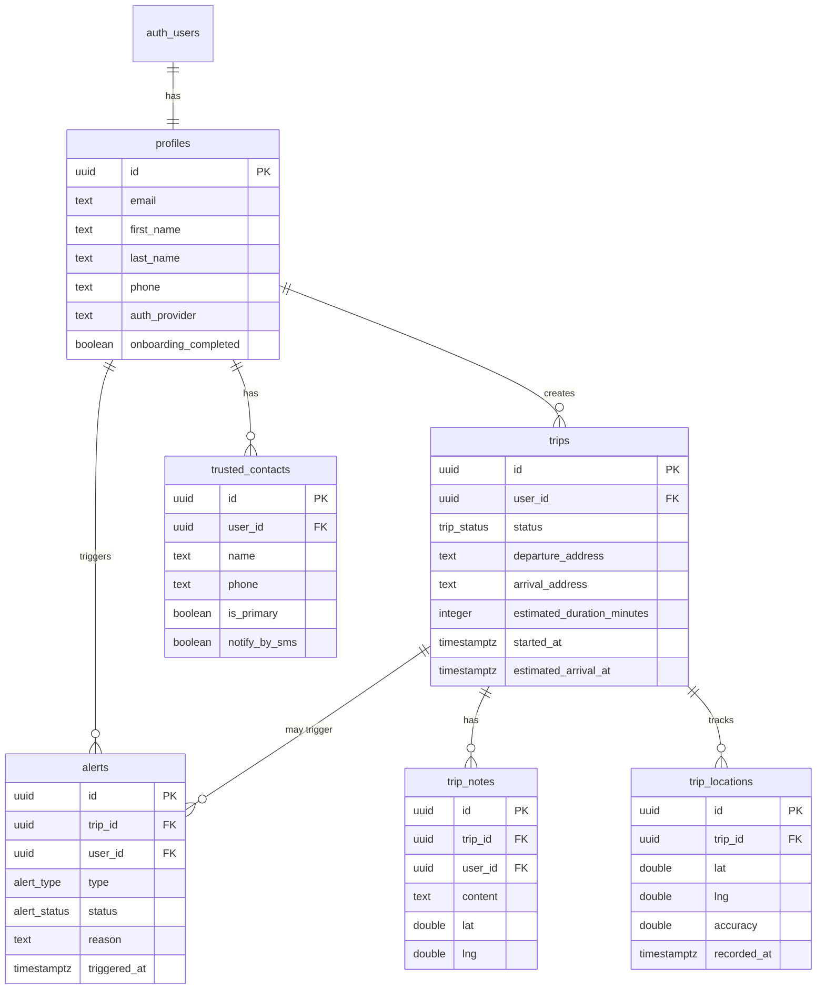

# Schéma de Base de Données — Prudency

## Vue d'ensemble

La base de données Supabase (PostgreSQL) contient 6 tables principales avec Row Level Security (RLS) activé sur chacune.

## Tables

### 1. `profiles`

Profils utilisateurs, créés automatiquement à l'inscription.

| Colonne | Type | Contraintes | Description |
|---------|------|-------------|-------------|
| `id` | UUID | PK, FK → auth.users(id) ON DELETE CASCADE | ID utilisateur Supabase |
| `email` | TEXT | NOT NULL | Email de l'utilisateur |
| `first_name` | TEXT | NULL | Prénom |
| `last_name` | TEXT | NULL | Nom |
| `phone` | TEXT | NULL | Numéro de téléphone |
| `avatar_url` | TEXT | NULL | URL de l'avatar |
| `auth_provider` | TEXT | DEFAULT 'email' | Provider d'auth: 'email', 'apple', 'google' |
| `onboarding_completed` | BOOLEAN | DEFAULT FALSE | Onboarding terminé |
| `created_at` | TIMESTAMPTZ | DEFAULT NOW() | Date de création |
| `updated_at` | TIMESTAMPTZ | DEFAULT NOW() | Dernière mise à jour |

**Triggers:**
- `profiles_updated_at`: Met à jour `updated_at` automatiquement
- `on_auth_user_created`: Crée le profil automatiquement à l'inscription

**RLS Policies:**
- Users can view own profile (SELECT)
- Users can update own profile (UPDATE)

---

### 2. `trips`

Trajets créés par les utilisateurs.

| Colonne | Type | Contraintes | Description |
|---------|------|-------------|-------------|
| `id` | UUID | PK, DEFAULT gen_random_uuid() | ID du trajet |
| `user_id` | UUID | NOT NULL, FK → profiles(id) ON DELETE CASCADE | Propriétaire |
| `status` | trip_status | DEFAULT 'draft' | Statut du trajet |
| `departure_address` | TEXT | NULL | Adresse de départ |
| `departure_lat` | DOUBLE PRECISION | NULL | Latitude départ |
| `departure_lng` | DOUBLE PRECISION | NULL | Longitude départ |
| `arrival_address` | TEXT | NULL | Adresse d'arrivée |
| `arrival_lat` | DOUBLE PRECISION | NULL | Latitude arrivée |
| `arrival_lng` | DOUBLE PRECISION | NULL | Longitude arrivée |
| `estimated_duration_minutes` | INTEGER | NOT NULL | Durée estimée en minutes |
| `started_at` | TIMESTAMPTZ | NULL | Heure de démarrage |
| `estimated_arrival_at` | TIMESTAMPTZ | NULL | Heure d'arrivée prévue |
| `completed_at` | TIMESTAMPTZ | NULL | Heure de complétion |
| `cancelled_at` | TIMESTAMPTZ | NULL | Heure d'annulation |
| `created_at` | TIMESTAMPTZ | DEFAULT NOW() | Date de création |
| `updated_at` | TIMESTAMPTZ | DEFAULT NOW() | Dernière mise à jour |

**Enum `trip_status`:**
- `draft`: Trajet en préparation
- `active`: Trajet en cours
- `completed`: Trajet terminé normalement
- `cancelled`: Trajet annulé
- `timeout`: Timeout sans validation
- `alerted`: Alerte déclenchée

**Index:**
- `idx_trips_user_id`
- `idx_trips_status`
- `idx_trips_active` (partial index pour trajets actifs)

**RLS Policies:**
- Users can view/create/update/delete own trips

---

### 3. `alerts`

Alertes déclenchées (manuelles ou automatiques).

| Colonne | Type | Contraintes | Description |
|---------|------|-------------|-------------|
| `id` | UUID | PK, DEFAULT gen_random_uuid() | ID de l'alerte |
| `trip_id` | UUID | FK → trips(id) ON DELETE SET NULL | Trajet associé (optionnel) |
| `user_id` | UUID | NOT NULL, FK → profiles(id) ON DELETE CASCADE | Utilisateur |
| `type` | alert_type | NOT NULL | Type d'alerte |
| `status` | alert_status | DEFAULT 'triggered' | Statut de l'alerte |
| `reason` | TEXT | NULL | Raison de l'alerte |
| `triggered_at` | TIMESTAMPTZ | DEFAULT NOW() | Heure de déclenchement |
| `triggered_lat` | DOUBLE PRECISION | NULL | Position au déclenchement |
| `triggered_lng` | DOUBLE PRECISION | NULL | Position au déclenchement |
| `battery_level` | INTEGER | NULL | Niveau de batterie (%) |
| `acknowledged_at` | TIMESTAMPTZ | NULL | Heure de prise en charge |
| `resolved_at` | TIMESTAMPTZ | NULL | Heure de résolution |
| `created_at` | TIMESTAMPTZ | DEFAULT NOW() | Date de création |

**Enum `alert_type`:**
- `manual`: Déclenchée par l'utilisateur
- `automatic`: Déclenchée par le système
- `timeout`: Déclenchée par timeout

**Enum `alert_status`:**
- `triggered`: Alerte active
- `acknowledged`: Prise en charge par un contact
- `resolved`: Résolue
- `false_alarm`: Fausse alerte

**RLS Policies:**
- Users can view/create/update own alerts

---

### 4. `trusted_contacts`

Contacts de confiance à prévenir en cas d'alerte.

| Colonne | Type | Contraintes | Description |
|---------|------|-------------|-------------|
| `id` | UUID | PK, DEFAULT gen_random_uuid() | ID du contact |
| `user_id` | UUID | NOT NULL, FK → profiles(id) ON DELETE CASCADE | Propriétaire |
| `name` | TEXT | NOT NULL | Nom du contact |
| `phone` | TEXT | NOT NULL | Numéro de téléphone |
| `email` | TEXT | NULL | Email (optionnel) |
| `is_primary` | BOOLEAN | DEFAULT FALSE | Contact principal |
| `notify_by_push` | BOOLEAN | DEFAULT TRUE | Notifier par push |
| `notify_by_sms` | BOOLEAN | DEFAULT TRUE | Notifier par SMS |
| `created_at` | TIMESTAMPTZ | DEFAULT NOW() | Date de création |
| `updated_at` | TIMESTAMPTZ | DEFAULT NOW() | Dernière mise à jour |

**RLS Policies:**
- Users can view/create/update/delete own contacts

---

### 5. `trip_notes`

Notes ajoutées pendant un trajet.

| Colonne | Type | Contraintes | Description |
|---------|------|-------------|-------------|
| `id` | UUID | PK, DEFAULT gen_random_uuid() | ID de la note |
| `trip_id` | UUID | NOT NULL, FK → trips(id) ON DELETE CASCADE | Trajet parent |
| `user_id` | UUID | NOT NULL, FK → profiles(id) ON DELETE CASCADE | Auteur |
| `content` | TEXT | NOT NULL | Contenu de la note |
| `lat` | DOUBLE PRECISION | NULL | Position lors de la note |
| `lng` | DOUBLE PRECISION | NULL | Position lors de la note |
| `created_at` | TIMESTAMPTZ | DEFAULT NOW() | Date de création |

**RLS Policies:**
- Users can view/create/delete own trip notes

---

### 6. `trip_locations`

Positions GPS trackées pendant les trajets.

| Colonne | Type | Contraintes | Description |
|---------|------|-------------|-------------|
| `id` | UUID | PK, DEFAULT gen_random_uuid() | ID de la position |
| `trip_id` | UUID | NOT NULL, FK → trips(id) ON DELETE CASCADE | Trajet parent |
| `lat` | DOUBLE PRECISION | NOT NULL | Latitude |
| `lng` | DOUBLE PRECISION | NOT NULL | Longitude |
| `accuracy` | DOUBLE PRECISION | NULL | Précision en mètres |
| `speed` | DOUBLE PRECISION | NULL | Vitesse en m/s |
| `heading` | DOUBLE PRECISION | NULL | Direction en degrés |
| `battery_level` | INTEGER | NULL | Niveau de batterie |
| `recorded_at` | TIMESTAMPTZ | DEFAULT NOW() | Heure d'enregistrement |

**Index:**
- `idx_trip_locations_trip_id`
- `idx_trip_locations_recorded` (composite, DESC)

**RLS Policies:**
- Users can view/insert locations for their own trips (via subquery)

---

## Diagramme ER

---

## Migrations

Les migrations sont dans `supabase/migrations/` et doivent être appliquées dans l'ordre :

1. `20250001_create_profiles.sql` - Table profiles + triggers
2. `20250002_create_trips.sql` - Table trips + enums
3. `20250003_create_alerts.sql` - Table alerts + enums
4. `20250004_create_contacts.sql` - Table trusted_contacts
5. `20250005_create_trip_notes.sql` - Table trip_notes
6. `20250006_create_trip_locations.sql` - Table trip_locations
7. `20250007_enable_rls.sql` - Activation RLS + policies
