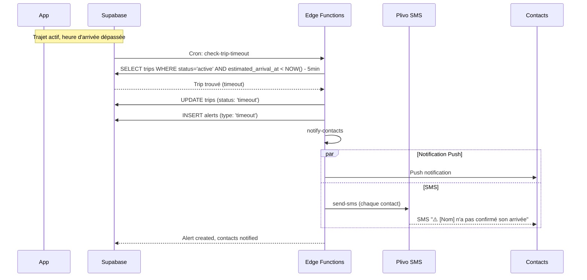
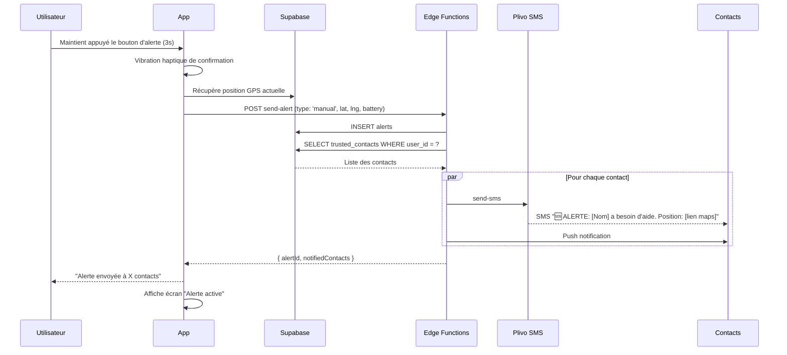
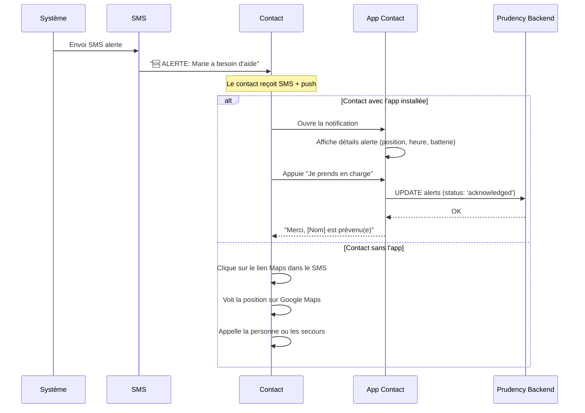
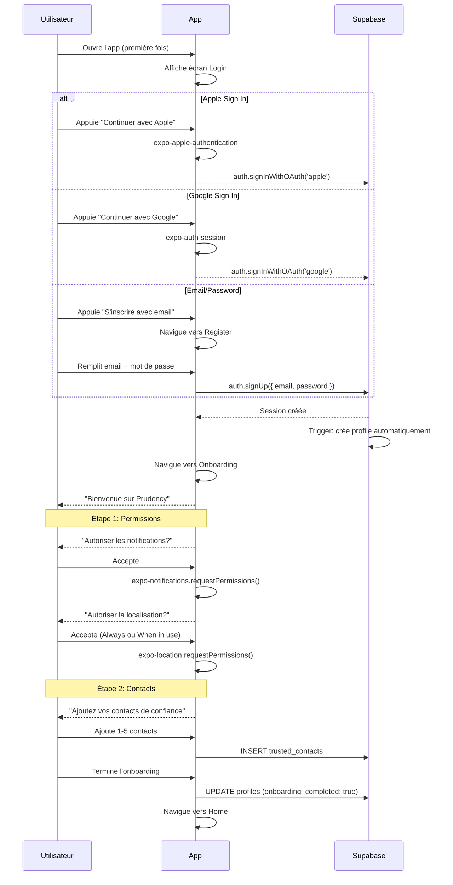

# User Flows — Prudency

Ce document décrit les parcours utilisateur principaux de l'application.

---

## 1. Trajet OK (Happy Path)

L'utilisateur crée un trajet, le démarre, et arrive à destination dans les temps.

---

## 2. Modification / Annulation de trajet

L'utilisateur modifie la durée ou annule un trajet en cours.

---

## 3. Problème détecté (Timeout)

L'utilisateur ne valide pas son arrivée dans les temps. Le système déclenche une alerte automatique.

---

## 4. Alerte manuelle

L'utilisateur déclenche une alerte volontairement (avec ou sans trajet actif).

---

## 5. Réception d'alerte (Contact de confiance)

Un contact de confiance reçoit une alerte et peut agir.

---

## 6. Inscription et Onboarding

Nouveau utilisateur s'inscrit et configure l'app.

---

## 7. Gestion des contacts de confiance

L'utilisateur ajoute, modifie ou supprime des contacts.

---

## Notes techniques

### GPS Tracking Strategy

1. **Au démarrage du trajet** : Haute fréquence (30s) pendant 2 minutes
2. **En cours de trajet** : Basse fréquence (60s)
3. **À l'approche de l'heure d'arrivée** : Haute fréquence (10s)
4. **Lors d'une alerte** : Temps réel (5s)

### Optimisation batterie

- Utiliser `expo-location` avec `accuracy: Accuracy.Balanced`
- Passer en `Accuracy.High` uniquement lors d'alertes
- Arrêter le tracking dès que le trajet est terminé
- Monitorer le niveau de batterie et avertir si < 15%
