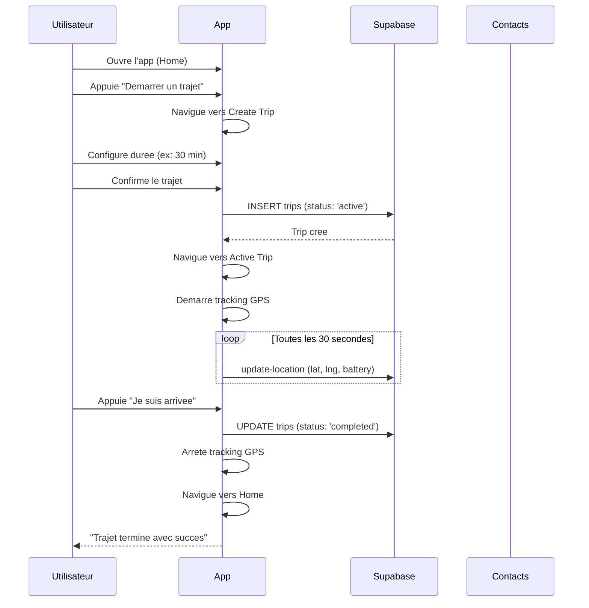
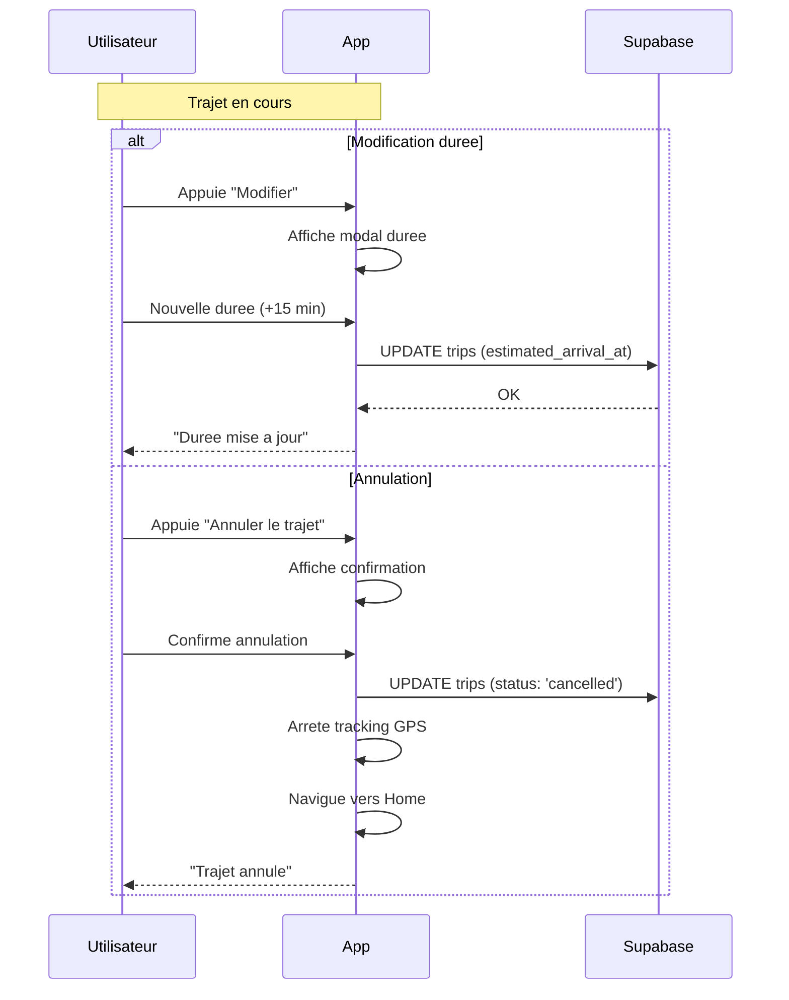
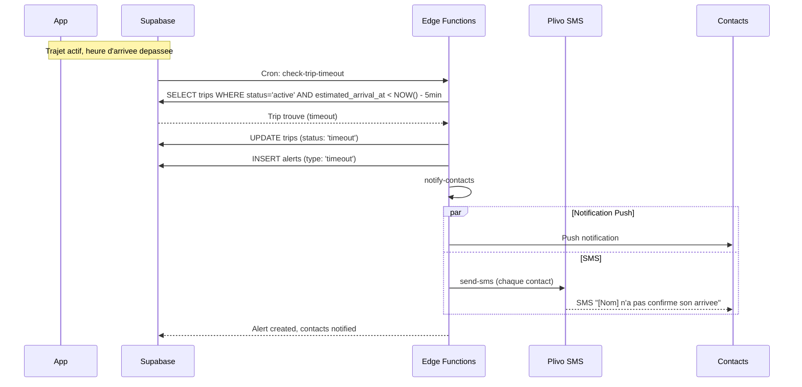
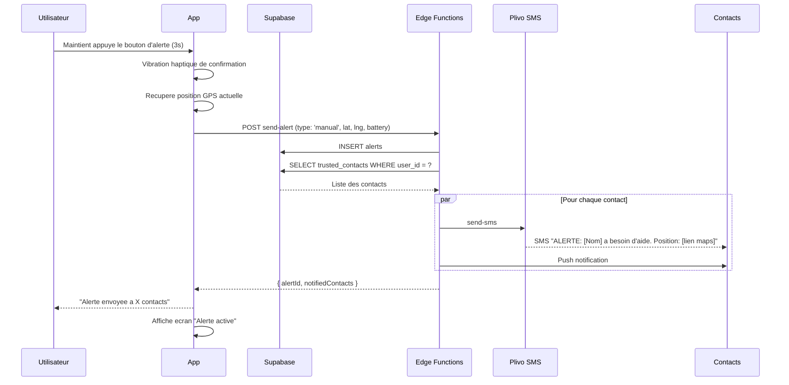
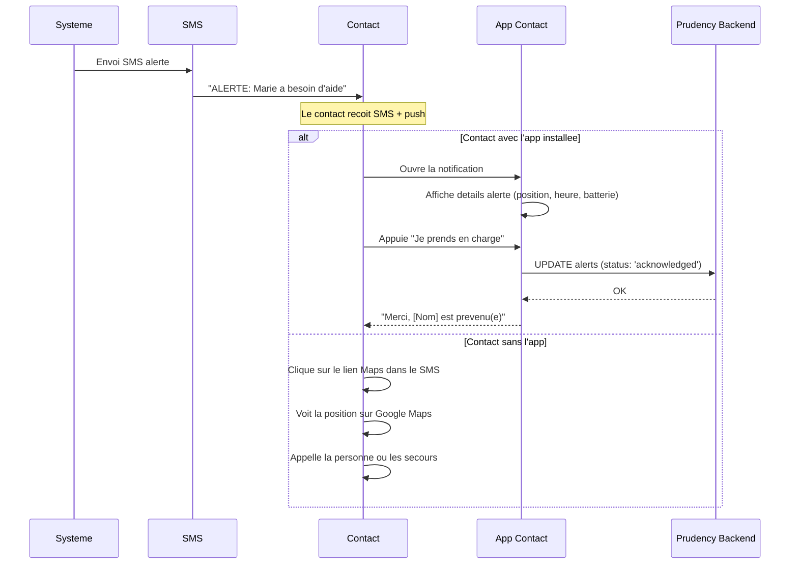
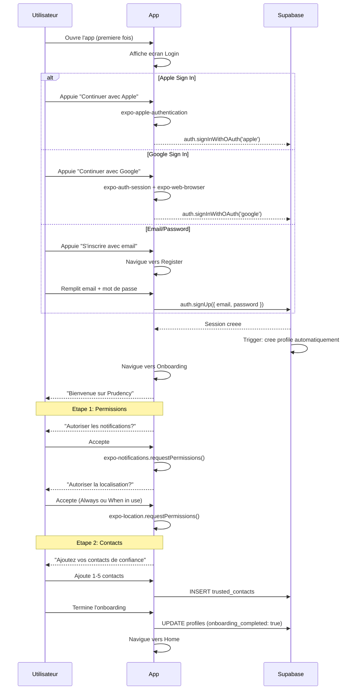
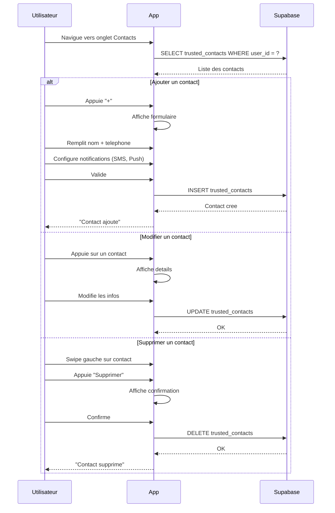

# User Flows -- Prudency

## Table des matieres

- [1. Trajet OK (Happy Path)](#1-trajet-ok-happy-path)
- [2. Modification / Annulation de trajet](#2-modification--annulation-de-trajet)
- [3. Probleme detecte (Timeout)](#3-probleme-detecte-timeout)
- [4. Alerte manuelle](#4-alerte-manuelle)
- [5. Reception d'alerte (Contact de confiance)](#5-reception-dalerte-contact-de-confiance)
- [6. Inscription et Onboarding](#6-inscription-et-onboarding)
- [7. Gestion des contacts de confiance](#7-gestion-des-contacts-de-confiance)
- [Notes techniques](#notes-techniques)
- [Cas limites et erreurs](#cas-limites-et-erreurs)

---

## 1. Trajet OK (Happy Path)

L'utilisateur cree un trajet, le demarre, et arrive a destination dans les temps.

---

## 2. Modification / Annulation de trajet

L'utilisateur modifie la duree ou annule un trajet en cours.

---

## 3. Probleme detecte (Timeout)

L'utilisateur ne valide pas son arrivee dans les temps. Le systeme declenche une alerte automatique apres 5 minutes de depassement.

---

## 4. Alerte manuelle

L'utilisateur declenche une alerte volontairement (avec ou sans trajet actif).

---

## 5. Reception d'alerte (Contact de confiance)

Un contact de confiance recoit une alerte et peut agir.

---

## 6. Inscription et Onboarding

Nouveau utilisateur s'inscrit et configure l'app.

---

## 7. Gestion des contacts de confiance

L'utilisateur ajoute, modifie ou supprime des contacts.

---

## Notes techniques

### Strategie de tracking GPS

| Phase | Frequence | Precision | Condition |
|-------|-----------|-----------|-----------|
| Demarrage du trajet | 30s | `Accuracy.Balanced` | 2 premieres minutes |
| En cours de trajet | 60s | `Accuracy.Balanced` | Mode normal |
| Approche heure d'arrivee | 10s | `Accuracy.Balanced` | 15 min avant l'heure estimee |
| Alerte active | 5s | `Accuracy.High` | Alerte declenchee |
| Trajet termine | Stop | -- | Tracking arrete |

### Optimisation batterie

- Utiliser `expo-location` avec `accuracy: Accuracy.Balanced` par defaut
- Passer en `Accuracy.High` uniquement lors d'alertes actives
- Arreter le tracking des que le trajet est termine ou annule
- Monitorer le niveau de batterie et avertir l'utilisateur si < 15%
- Le niveau de batterie est inclus dans chaque mise a jour de position

---

## Cas limites et erreurs

### Perte de connexion reseau

- Les mises a jour de position sont mises en file d'attente localement
- L'alerte manuelle est tentee des que la connexion revient
- L'utilisateur voit un indicateur "hors ligne" dans l'app

### Batterie faible (< 15%)

- L'app affiche un avertissement a l'utilisateur
- Le niveau de batterie est envoye aux contacts lors d'une alerte
- La frequence de tracking est reduite pour economiser la batterie

### Permissions refusees

- Si la localisation est refusee : l'utilisateur peut creer un trajet mais sans tracking GPS
- Si les notifications sont refusees : l'alerte fonctionne mais les contacts ne recoivent pas de push
- L'app guide l'utilisateur vers les reglages systeme pour reactiver les permissions

### Maximum de contacts atteint

- L'insertion est bloquee par le trigger `enforce_max_contacts` (max 5)
- L'app affiche un message expliquant la limite
- L'utilisateur doit supprimer un contact existant avant d'en ajouter un nouveau

### Maximum de notes atteint

- L'insertion est bloquee par le trigger `enforce_max_trip_notes` (max 20)
- L'app affiche un message expliquant la limite

### Echec d'envoi SMS

- L'echec est consigne dans le tableau `failures` de la reponse `notify-contacts`
- Les autres contacts sont quand meme notifies
- L'utilisateur est informe du nombre de contacts effectivement notifies

---

**Voir aussi :**
- [Reference API](./api-reference.md) -- documentation des Edge Functions utilisees dans ces flows
- [Schema BDD](./database-schema.md) -- structure des donnees
- [Architecture](./architecture.md) -- vue d'ensemble technique
